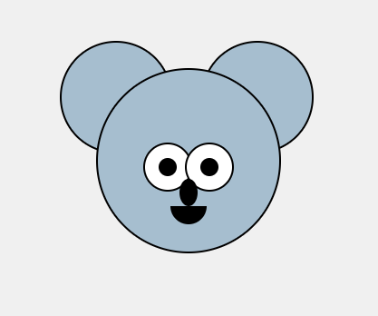

# Использование `absolute` позиционирования

## Срок сдачи работ

Последний коммит и пул реквест должен быть оформлен до 24.04.2025

## Цель:

Нарисуйте коалу с помощью HTML и CSS

<p align="center">

</p>

### Использованные цвета

#A6BECF

### Стартовый CSS

```CSS
body {
    display: flex;
    justify-content: center;
    align-items: center;
    height: 100vh;
    margin: 0;
}

.koala {
    position: relative;
}
```

## Как сдавать

1. Создайте форк репозитория в организации `21ISR` с названием `uidev-lab9-вашафамилия`
2. Используя ветку `wip` оформите необходимые файлы
3. Зафиксируйте изменения в вашем репозитории
4. Когда документ будет готов - создайте пул реквест из ветки `wip` (вашей) на ветку `main` (тоже вашу) и укажите меня ([ktkv419](https://github.com/ktkv419)) как reviewer

**Не мержите сами коммит**, это сделаю я после проверки задания
